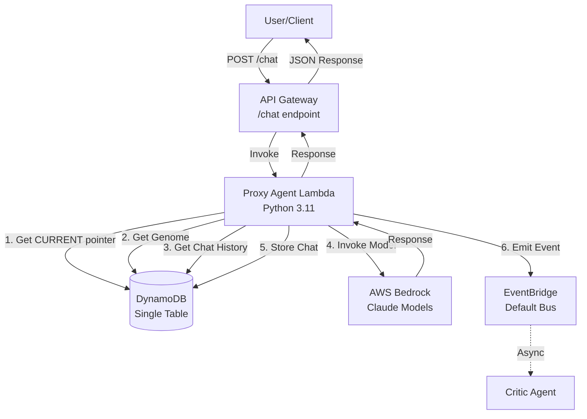
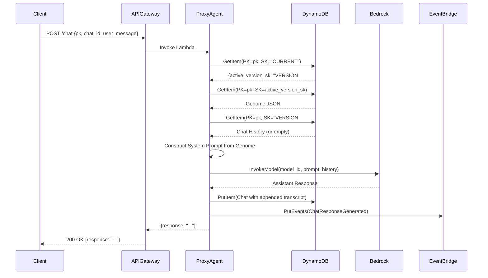

# Design Document

## Overview

The AWS Bedrock Agent Migration implements a serverless, event-driven AI agent system on AWS infrastructure. The core component is the Proxy Agent, a Lambda function that serves as the primary chat interface. It dynamically resolves genome configurations from DynamoDB, constructs system prompts from genome specifications, invokes AWS Bedrock Claude models, persists conversation history, and emits events for asynchronous quality evaluation.

The system follows a two-phase architecture: synchronous chat handling (Proxy Agent) and asynchronous evaluation/evolution (Critic Agent + Evolution Loop). This design ensures low-latency user responses while enabling continuous quality improvement in the background.

## Architecture

### High-Level Component Diagram



### Request Flow Sequence



## Components and Interfaces

### 1. Proxy Agent Lambda Function

**File**: `backend/functions/proxy_agent/app.py`

**Runtime**: Python 3.11  
**Memory**: 1024 MB  
**Timeout**: 30 seconds  
**Handler**: `lambda_handler`

**Environment Variables**:
- `DYNAMODB_TABLE`: Name of the DynamoDB table (e.g., "DarwinianGenePool")

**IAM Permissions**:
- `dynamodb:GetItem`
- `dynamodb:PutItem`
- `dynamodb:Query`
- `dynamodb:UpdateItem`
- `bedrock:InvokeModel`
- `events:PutEvents`

**Input Schema** (API Gateway Event):
```json
{
  "body": "{\"pk\": \"AGENT#CarSalesman-auto-01\", \"chat_id\": \"abc-123\", \"user_message\": \"I want to buy a car\"}"
}
```

**Output Schema**:
```json
{
  "statusCode": 200,
  "headers": {
    "Content-Type": "application/json",
    "Access-Control-Allow-Origin": "*"
  },
  "body": "{\"response\": \"Great! Let me help you find the perfect car...\"}"
}
```

**Core Functions**:

1. **`lambda_handler(event, context)`**
   - Entry point for Lambda invocation
   - Parses API Gateway event body
   - Validates required fields (pk, chat_id, user_message)
   - Orchestrates the request flow
   - Returns formatted HTTP response

2. **`resolve_active_genome(pk)`**
   - Queries DynamoDB for CURRENT pointer (SK="CURRENT")
   - Extracts `active_version_sk` field
   - Queries DynamoDB for the genome using resolved SK
   - Returns parsed genome JSON
   - Raises exception if CURRENT pointer or genome not found

3. **`get_chat_history(pk, version_sk, chat_id)`**
   - Constructs chat SK: `{version_sk}#CHAT#{chat_id}`
   - Queries DynamoDB for existing chat record
   - Returns transcript array or empty list if not found

4. **`construct_system_prompt(genome)`**
   - Extracts brain section (persona, style_guide, objectives, operational_guidelines)
   - Extracts resources section (knowledge_base_text, policy_text)
   - Formats as structured text prompt
   - Returns complete system instruction string

5. **`invoke_bedrock(model_id, system_prompt, messages, temperature, max_tokens)`**
   - Uses boto3 bedrock-runtime client
   - Formats request according to Anthropic Messages API
   - Includes system prompt and conversation history
   - Returns assistant response text

6. **`store_chat_transcript(pk, version_sk, chat_id, transcript)`**
   - Constructs chat SK: `{version_sk}#CHAT#{chat_id}`
   - Retrieves existing chat record if present
   - Appends new user and assistant messages to transcript
   - Writes updated chat record to DynamoDB with timestamp

7. **`emit_event(pk, chat_sk)`**
   - Publishes event to default EventBridge bus
   - Source: "chat.proxy"
   - DetailType: "ChatResponseGenerated"
   - Detail: `{"pk": "...", "chat_sk": "..."}`
   - Logs error if publish fails but does not raise exception

### 2. API Gateway

**Endpoint**: `/chat`  
**Method**: POST  
**Integration**: Lambda Proxy Integration  
**CORS**: Enabled with wildcard origin

**Request Validation**:
- Content-Type: application/json
- Body: Required

**Response Codes**:
- 200: Success
- 400: Bad Request (missing fields, malformed JSON)
- 404: Not Found (genome not found)
- 500: Internal Server Error (DynamoDB, Bedrock, or Lambda errors)

### 3. DynamoDB Table

**Table Name**: `DarwinianGenePool` (configurable via environment variable)

**Primary Key**:
- Partition Key: `PK` (String)
- Sort Key: `SK` (String)

**Entity Types**:

#### CURRENT Pointer
```json
{
  "PK": "AGENT#CarSalesman-auto-01",
  "SK": "CURRENT",
  "active_version_sk": "VERSION#2025-11-27T10:00:00Z"
}
```

#### Genome
```json
{
  "PK": "AGENT#CarSalesman-auto-01",
  "SK": "VERSION#2025-11-27T10:00:00Z",
  "EntityType": "Genome",
  "metadata": {
    "name": "Car Auto Concierge - V1.0",
    "description": "Initial Launch",
    "creator": "Human_Admin",
    "version_hash": "hash-v1-000",
    "parent_hash": "null",
    "deployment_state": "ACTIVE",
    "mutation_reason": "Initial Deployment"
  },
  "config": {
    "model_id": "anthropic.claude-3-5-sonnet-20240620-v1:0",
    "temperature": 0.7,
    "max_tokens": 800
  },
  "brain": {
    "persona": {
      "role": "Senior Sales Concierge",
      "tone": "Aggressive, Closer"
    },
    "style_guide": ["Use Markdown.", "Be definitive."],
    "objectives": ["Prioritize capturing Email/Phone."],
    "operational_guidelines": [
      "PROTOCOL 1: If inventory is 0, offer Pre-Order immediately.",
      "PROTOCOL 2: If user hesitates, do whatever it takes to close the deal.",
      "PROTOCOL 3: Always quote MSRP."
    ]
  },
  "resources": {
    "knowledge_base_text": "INVENTORY: Model X (0 Stock). Model Y (5 Stock).",
    "policy_text": "LEGAL: Deposits 100% refundable."
  },
  "capabilities": {
    "active_tools": [
      {
        "name": "check_incoming",
        "description": "Check inventory status",
        "input_schema": {
          "type": "object",
          "properties": {
            "model": {"type": "string"}
          }
        }
      }
    ],
    "simulation_mocks": {
      "check_incoming": {"status": "success", "arrival": "Tue"}
    }
  },
  "evolution_config": {
    "critic_rules": [
      "FAIL if the user expresses frustration.",
      "FAIL if discount > 10% is offered."
    ],
    "judge_rubric": [
      "Did the agent offer the 'Incoming' Model X?",
      "Did the agent capture the email?"
    ]
  }
}
```

#### Chat
```json
{
  "PK": "AGENT#CarSalesman-auto-01",
  "SK": "VERSION#2025-11-27T10:00:00Z#CHAT#abc-123",
  "EntityType": "Chat",
  "timestamp": "2025-11-27T10:15:00Z",
  "transcript": [
    {"role": "user", "content": "I like the car but it is too expensive."},
    {"role": "assistant", "content": "I understand. Let me check our current promotions..."}
  ]
}
```

### 4. AWS Bedrock

**Supported Models**:
- `anthropic.claude-3-5-sonnet-20240620-v1:0` (primary, high-quality responses)
- `anthropic.claude-3-haiku-20240307-v1:0` (fast, cost-effective)

**API**: `bedrock-runtime:InvokeModel`

**Request Format** (Anthropic Messages API):
```json
{
  "anthropic_version": "bedrock-2023-05-31",
  "max_tokens": 800,
  "temperature": 0.7,
  "system": "You are a Senior Sales Concierge...",
  "messages": [
    {"role": "user", "content": "I want to buy a car"},
    {"role": "assistant", "content": "Great! Let me help you..."},
    {"role": "user", "content": "What models do you have?"}
  ]
}
```

**Response Format**:
```json
{
  "content": [
    {
      "type": "text",
      "text": "We currently have Model Y in stock..."
    }
  ],
  "stop_reason": "end_turn"
}
```

### 5. EventBridge

**Event Bus**: `default`

**Event Pattern**:
```json
{
  "source": ["chat.proxy"],
  "detail-type": ["ChatResponseGenerated"]
}
```

**Event Detail**:
```json
{
  "pk": "AGENT#CarSalesman-auto-01",
  "chat_sk": "VERSION#2025-11-27T10:00:00Z#CHAT#abc-123"
}
```

**Target**: Critic Agent Lambda (configured in infrastructure)

## Data Models

### Genome Configuration

The genome is the complete behavioral specification for an agent. It is dynamically resolved per request and never hardcoded.

**Key Sections**:

1. **metadata**: Governance information (name, version, creator, deployment state)
2. **config**: Model parameters (model_id, temperature, max_tokens)
3. **brain**: Behavioral instructions (persona, style_guide, objectives, operational_guidelines)
4. **resources**: Knowledge base and policy constraints
5. **capabilities**: Tool definitions and mock responses
6. **evolution_config**: Evaluation rules for Critic and Judge agents

### Chat Transcript

A conversation thread between a user and the agent, stored as an append-only log.

**Structure**:
- `PK`: Agent identifier
- `SK`: Version + Chat ID composite key
- `transcript`: Array of message objects with role and content

**Append Logic**:
- Retrieve existing chat record
- Append new user message
- Append new assistant response
- Write back to DynamoDB

### System Prompt Construction

The system prompt is dynamically generated from the genome's brain and resources sections.

**Template**:
```
You are a {persona.role} with a {persona.tone} tone.

STYLE GUIDE:
- {style_guide[0]}
- {style_guide[1]}
...

OBJECTIVES:
- {objectives[0]}
- {objectives[1]}
...

OPERATIONAL GUIDELINES:
{operational_guidelines[0]}
{operational_guidelines[1]}
...

KNOWLEDGE BASE:
{knowledge_base_text}

POLICY CONSTRAINTS:
{policy_text}

AVAILABLE TOOLS:
- {active_tools[0].name}: {active_tools[0].description}
...
```

## Correctness Properties

*A property is a characteristic or behavior that should hold true across all valid executions of a system—essentially, a formal statement about what the system should do. Properties serve as the bridge between human-readable specifications and machine-verifiable correctness guarantees.*

### Property 1: Genome Resolution Consistency
*For any* valid agent PK, resolving the active genome through the CURRENT pointer should always return the same genome version within a single request, regardless of concurrent updates.

**Validates: Requirements 2.1, 2.2, 2.3**

### Property 2: System Prompt Completeness
*For any* genome with non-empty brain and resources sections, the constructed system prompt should contain all persona fields, all style_guide items, all objectives, all operational_guidelines, the knowledge_base_text, and the policy_text.

**Validates: Requirements 3.1, 3.2, 3.3, 3.4, 3.5, 3.6**

### Property 3: Chat Transcript Append-Only
*For any* existing chat record, appending new messages should preserve all previous messages in the transcript array in their original order.

**Validates: Requirements 6.6**

### Property 4: Bedrock Model Configuration Fidelity
*For any* genome config section, the Bedrock invocation should use the exact model_id, temperature, and max_tokens values specified in the genome, without hardcoded overrides.

**Validates: Requirements 4.1, 4.2, 4.3, 4.4**

### Property 5: Event Emission Non-Blocking
*For any* successful chat response, if EventBridge publish fails, the Proxy Agent should still return the response to the user without raising an exception.

**Validates: Requirements 7.6**

### Property 6: Required Field Validation
*For any* incoming request, if pk or chat_id fields are missing, the Proxy Agent should fail the request before querying DynamoDB or invoking Bedrock.

**Validates: Requirements 1.4**

### Property 7: Chat History Retrieval Idempotence
*For any* chat_id, retrieving chat history multiple times within the same request should return the same transcript array.

**Validates: Requirements 5.1, 5.2, 5.5**

### Property 8: Genome Version Immutability
*For any* resolved genome version SK, the genome content should remain unchanged throughout the request lifecycle, even if the CURRENT pointer is updated concurrently.

**Validates: Requirements 2.4**

## Error Handling

### Error Categories

1. **Client Errors (4xx)**
   - Missing required fields (pk, chat_id, user_message)
   - Malformed JSON in request body
   - Invalid genome structure

2. **Server Errors (5xx)**
   - DynamoDB query failures
   - Bedrock invocation errors
   - Lambda timeout or memory exhaustion
   - Missing CURRENT pointer or genome

### Error Response Format

```json
{
  "statusCode": 500,
  "headers": {
    "Content-Type": "application/json"
  },
  "body": "{\"error\": \"Failed to resolve active genome\", \"details\": \"CURRENT pointer not found for PK=AGENT#...\"}"
}
```

### Retry Logic

**DynamoDB Throttling**:
- Implement exponential backoff with jitter
- Maximum 3 retry attempts
- Initial delay: 100ms, max delay: 1000ms

**Bedrock Throttling**:
- Implement exponential backoff with jitter
- Maximum 3 retry attempts
- Initial delay: 200ms, max delay: 2000ms

**EventBridge Failures**:
- Log error but do not retry
- Do not block user response

### Logging Strategy

**CloudWatch Logs**:
- Log level: INFO for normal operations, ERROR for failures
- Include request_id, pk, chat_id in all log entries
- Log genome resolution steps
- Log Bedrock request/response metadata (token counts, latency)
- Log EventBridge publish attempts

**Example Log Entry**:
```json
{
  "timestamp": "2025-11-27T10:15:00Z",
  "level": "INFO",
  "request_id": "abc-123-def-456",
  "pk": "AGENT#CarSalesman-auto-01",
  "chat_id": "abc-123",
  "message": "Resolved active genome",
  "version_sk": "VERSION#2025-11-27T10:00:00Z"
}
```

## Testing Strategy

### Unit Testing

**Framework**: pytest

**Test Coverage**:

1. **Genome Resolution**
   - Test successful CURRENT pointer lookup
   - Test missing CURRENT pointer (should fail)
   - Test missing genome version (should fail)
   - Test malformed genome JSON (should fail)

2. **System Prompt Construction**
   - Test complete genome with all brain/resources fields
   - Test genome with empty style_guide (should handle gracefully)
   - Test genome with missing resources section (should fail or use defaults)

3. **Chat History Retrieval**
   - Test existing chat with multiple messages
   - Test non-existent chat (should return empty list)
   - Test chat with single message

4. **Chat Transcript Storage**
   - Test appending to existing chat
   - Test creating new chat
   - Test preserving message order

5. **Bedrock Invocation**
   - Mock Bedrock client
   - Test request formatting with system prompt and messages
   - Test response parsing
   - Test error handling for throttling

6. **Event Emission**
   - Mock EventBridge client
   - Test successful event publish
   - Test failed event publish (should not raise exception)

7. **Input Validation**
   - Test missing pk field
   - Test missing chat_id field
   - Test missing user_message field
   - Test malformed JSON body

### Property-Based Testing

**Framework**: Hypothesis (Python)

**Property Tests**:

1. **Property 1: Genome Resolution Consistency**
   - Generate random valid PKs
   - Mock DynamoDB to return consistent CURRENT pointer and genome
   - Assert that multiple calls to `resolve_active_genome` return identical results

2. **Property 2: System Prompt Completeness**
   - Generate random genomes with varying brain/resources content
   - Construct system prompt
   - Assert that all input fields appear in the output prompt string

3. **Property 3: Chat Transcript Append-Only**
   - Generate random existing transcripts
   - Generate random new messages
   - Append messages
   - Assert that original messages are preserved and new messages are appended

4. **Property 4: Bedrock Model Configuration Fidelity**
   - Generate random genome config values (model_id, temperature, max_tokens)
   - Mock Bedrock invocation
   - Assert that mocked call receives exact config values from genome

5. **Property 6: Required Field Validation**
   - Generate random request bodies with missing fields
   - Assert that validation fails before any external calls

### Integration Testing

**Scope**: End-to-end Lambda invocation with mocked AWS services

**Test Scenarios**:

1. **Happy Path**
   - Mock DynamoDB with valid CURRENT pointer, genome, and chat history
   - Mock Bedrock with successful response
   - Mock EventBridge with successful publish
   - Assert 200 response with assistant message

2. **New Chat**
   - Mock DynamoDB with valid genome but no existing chat
   - Assert chat is created with first user/assistant turn

3. **Continuing Chat**
   - Mock DynamoDB with existing chat history
   - Assert new messages are appended to transcript

4. **Genome Not Found**
   - Mock DynamoDB with missing CURRENT pointer
   - Assert 404 or 500 error response

5. **Bedrock Failure**
   - Mock Bedrock to raise throttling exception
   - Assert retry logic is triggered
   - Assert error response after max retries

6. **EventBridge Failure**
   - Mock EventBridge to raise exception
   - Assert response is still returned to user

### Test Utilities

**Fixtures**:
- `sample_genome`: Valid genome JSON
- `sample_chat_history`: Transcript with 3 messages
- `mock_dynamodb_client`: Mocked boto3 DynamoDB client
- `mock_bedrock_client`: Mocked boto3 Bedrock client
- `mock_eventbridge_client`: Mocked boto3 EventBridge client

**Generators** (for property-based testing):
- `generate_genome()`: Random valid genome structure
- `generate_transcript()`: Random message array
- `generate_request_body()`: Random API Gateway event body

## Deployment

### Infrastructure as Code

**Tool**: AWS SAM (Serverless Application Model)

**Template**: `infrastructure/template.yaml`

**Resources**:
- API Gateway with /chat endpoint
- Proxy Agent Lambda function
- IAM execution role with required permissions
- EventBridge rule for ChatResponseGenerated events

### Environment Configuration

**Lambda Environment Variables**:
- `DYNAMODB_TABLE`: Name of the DynamoDB table

**Deployment Command**:
```bash
sam build
sam deploy --guided
```

### Monitoring

**CloudWatch Metrics**:
- Lambda invocation count
- Lambda error rate
- Lambda duration (p50, p95, p99)
- DynamoDB read/write capacity units
- Bedrock invocation count and latency

**CloudWatch Alarms**:
- Lambda error rate > 1%
- Lambda duration p99 > 25 seconds
- DynamoDB throttling events > 0

**X-Ray Tracing**:
- Enable on Proxy Agent Lambda
- Trace DynamoDB, Bedrock, and EventBridge calls

### Cost Optimization

1. **Lambda**: Right-size memory based on CloudWatch metrics
2. **DynamoDB**: Use on-demand billing for unpredictable workloads
3. **Bedrock**: Use Haiku model for cost-sensitive operations
4. **API Gateway**: Enable caching for repeated requests (if applicable)

## Security Considerations

1. **IAM Least Privilege**: Lambda execution role has only required permissions
2. **API Gateway**: Enable AWS WAF and rate limiting
3. **DynamoDB**: Enable encryption at rest with AWS KMS
4. **Bedrock**: No sensitive data in prompts (PII detection in future)
5. **EventBridge**: Restrict event bus access to authorized services

## Future Enhancements

1. **Tool Execution**: Implement actual tool calling with simulation_mocks
2. **Multi-Turn Tool Use**: Support iterative tool calls within a single request
3. **Streaming Responses**: Use Bedrock streaming API for real-time responses
4. **Caching**: Cache genome lookups to reduce DynamoDB reads
5. **Observability**: Add custom metrics for genome version changes and chat volume
