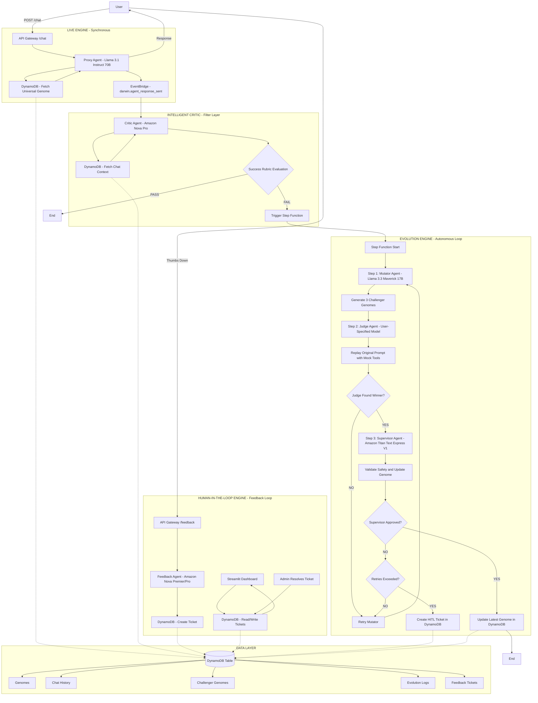

# Darwinian Agent Engine - Master Architecture Specification

## Executive Summary

The Darwinian Agent Engine is a self-healing, evolutionary AI system built on AWS serverless infrastructure. It implements a dual-engine architecture that separates real-time user interaction from autonomous quality improvement. The system operates through four interconnected engines:

**The Live Engine** provides synchronous user interactions via API Gateway, with a Proxy Agent powered by Llama 3.1 Instruct 70B (model-agnostic design) handling chat requests and retrieving system instructions (the "Universal Genome") from DynamoDB.

**The Intelligent Critic** acts as a quality filter, evaluating every agent response against a strict Success Rubric using Amazon Nova Pro. Only failures trigger the evolution process, ensuring computational efficiency while maintaining high quality standards.

**The Evolution Engine** implements an autonomous improvement loop using Step Functions. When triggered, it generates challenger genomes through LLM-based mutation using Llama 3.3 Maverick 17B, validates them through simulated replay using the same model as specified in the genome (Judge Agent), and applies safety checks using Amazon Titan Text Express V1 (Supervisor) before updating the production genome. Built-in retry logic handles edge cases, escalating to human review when automated resolution fails.

**The Human-in-the-Loop Engine** captures explicit user feedback through a thumbs-down mechanism, creating tickets for admin review via a Streamlit dashboard. This provides a manual override path for cases where automated evolution is insufficient.

The architecture achieves self-healing through continuous evaluation and mutation, with DynamoDB serving as the single source of truth for genomes, chat history, evolution logs, and feedback tickets.

---

## System Architecture Diagram



---

## Component Responsibility Matrix

| Component | Model/Technology | Description |
|-----------|------------------|-------------|
| **API Gateway (/chat)** | AWS API Gateway | Synchronous REST endpoint for user chat requests. Routes to Proxy Agent Lambda. |
| **Proxy Agent** | Llama 3.1 Instruct 70B | Primary conversational agent with model-agnostic design. Fetches Universal Genome from DynamoDB, processes user requests, and emits response events to EventBridge. |
| **EventBridge** | AWS EventBridge | Event bus for asynchronous workflows. Captures `darwin.agent_response_sent` events and triggers Critic Agent. |
| **Critic Agent** | Amazon Nova Pro | Quality filter that evaluates agent responses against Success Rubric. Fetches chat context from DynamoDB and triggers Evolution Engine only on failures. |
| **Step Function** | AWS Step Functions | Orchestrates the Evolution Engine workflow with retry logic and error handling. Coordinates Mutator, Judge, and Supervisor agents. |
| **Mutator Agent** | Llama 3.3 Maverick 17B | Generates 3 challenger genomes through LLM-based mutation techniques. Uses advanced prompt engineering to create variations of the Universal Genome. |
| **Judge Agent** | User-Specified Model (from Genome) | Replays original user prompt against each challenger genome using mock tools and historical data. Uses the same model specified in the genome structure for consistency. Selects winning genome based on performance metrics. |
| **Supervisor Agent** | Amazon Titan Text Express V1 | Final safety validator. Reviews winning genome for security, compliance, and quality before approving DynamoDB update. |
| **API Gateway (/feedback)** | AWS API Gateway | Endpoint for explicit user feedback (thumbs down). Routes to Feedback Agent Lambda. |
| **Feedback Agent** | Amazon Nova Premier | Processes and structures user feedback, creating detailed tickets in DynamoDB for admin review. Also uses Amazon Nova Pro for additional analysis. |
| **Streamlit Dashboard** | Streamlit (Python) | Admin interface for reviewing and resolving HITL tickets. Reads/writes directly to DynamoDB. Isolated from Proxy Agent. |
| **DynamoDB Table** | AWS DynamoDB | Single-table design storing: Universal Genome (system instructions), Chat History, Challenger Genomes, Evolution Logs, and Feedback Tickets. |

---

## The Critic Rubric

The Critic Agent evaluates every agent response using a strict binary classification system. This rubric determines whether the Evolution Engine should be triggered.

### Evaluation Logic

**PASS Criteria** (No Evolution Triggered):
- Agent successfully completed the user request
- Response was accurate and relevant
- No error codes or exceptions detected
- User intent was properly understood and addressed
- Agent behavior aligned with system guidelines

**FAIL Criteria** (Evolution Engine Triggered):

1. **Agent Failed**: The agent was unable to complete the requested task or action.

2. **Refused Needlessly**: The agent declined a legitimate request that should have been handled within its capabilities and safety guidelines.

3. **Hallucinated**: The agent provided factually incorrect information, fabricated data, or made unsupported claims.

4. **User Unsatisfied**: Explicit or implicit signals of user dissatisfaction detected in follow-up messages or tone.

5. **Error Code Detected**: System errors, exceptions, timeouts, or technical failures occurred during request processing.

### Implementation Details

The Critic Agent receives:
- Original user prompt
- Agent response
- Chat context (previous 5 messages)
- Execution metadata (latency, token count, tool calls)

The Critic outputs:
- Binary decision: `PASS` or `FAIL`
- Failure category (if applicable)
- Confidence score (0.0 - 1.0)
- Reasoning summary (stored in Evolution Logs)

### Retry Logic

**Loop 1 - Judge Retry**: If the Judge Agent cannot identify a winning challenger genome after evaluating all 3 candidates, the system returns to the Mutator Agent to generate a new set of 3 challengers. Maximum retries: 2.

**Loop 2 - Supervisor Retry**: If the Supervisor Agent rejects the winning genome due to safety or quality concerns, the system returns to the Mutator Agent to generate new challengers. Maximum retries: 2.

**Escalation**: If total retries exceed 4 attempts (2 Judge + 2 Supervisor), the system creates a Human-in-the-Loop ticket in DynamoDB for manual admin review via the Streamlit Dashboard.

---

## Data Model

### DynamoDB Single Table Design

**Primary Key Structure**:
- `PK` (Partition Key): Entity type and identifier
- `SK` (Sort Key): Version or timestamp

**Entity Types**:

1. **Universal Genome**
   - `PK`: `GENOME#LATEST`
   - `SK`: `v{version_number}`
   - Attributes: `prompt_template`, `system_instructions`, `tool_definitions`, `updated_at`, `updated_by`

2. **Chat History**
   - `PK`: `USER#{user_id}`
   - `SK`: `CHAT#{timestamp}`
   - Attributes: `message`, `role`, `response`, `latency_ms`, `tokens_used`

3. **Challenger Genomes**
   - `PK`: `EVOLUTION#{evolution_id}`
   - `SK`: `CHALLENGER#{challenger_number}`
   - Attributes: `genome_content`, `mutation_strategy`, `judge_score`, `selected`

4. **Evolution Logs**
   - `PK`: `EVOLUTION#{evolution_id}`
   - `SK`: `LOG#{timestamp}`
   - Attributes: `trigger_reason`, `critic_reasoning`, `winner_id`, `retry_count`, `status`

5. **Feedback Tickets**
   - `PK`: `TICKET#{ticket_id}`
   - `SK`: `METADATA`
   - Attributes: `user_id`, `chat_context`, `feedback_text`, `status`, `assigned_to`, `resolved_at`

---

## AWS Service Configuration

### Lambda Functions

| Function Name | Runtime | Memory | Timeout | Trigger |
|---------------|---------|--------|---------|---------|
| `proxy-agent` | Python 3.12 | 1024 MB | 30s | API Gateway |
| `critic-agent` | Python 3.12 | 512 MB | 15s | EventBridge |
| `mutator-agent` | Python 3.12 | 2048 MB | 120s | Step Functions |
| `judge-agent` | Python 3.12 | 1024 MB | 60s | Step Functions |
| `supervisor-agent` | Python 3.12 | 1024 MB | 30s | Step Functions |
| `feedback-agent` | Python 3.12 | 256 MB | 10s | API Gateway |

### IAM Permissions

Each Lambda requires:
- DynamoDB: `GetItem`, `PutItem`, `Query`, `UpdateItem`
- EventBridge: `PutEvents` (Proxy Agent only)
- Step Functions: `StartExecution` (Critic Agent only)
- Bedrock: `InvokeModel` (for Claude API calls)

### EventBridge Rule

**Rule Name**: `darwin-agent-response-rule`
**Event Pattern**:
```json
{
  "source": ["darwin.agent"],
  "detail-type": ["agent_response_sent"]
}
```
**Target**: Critic Agent Lambda

### Step Function State Machine

**Execution Role**: Requires Lambda invoke permissions
**Retry Configuration**: Exponential backoff with 3 attempts
**Timeout**: 10 minutes
**Error Handling**: Catch all errors and create HITL tickets

---

## Security Considerations

1. **API Gateway**: Enable AWS WAF, rate limiting (100 req/min per IP), and API key authentication.

2. **Lambda**: VPC isolation for sensitive operations, environment variable encryption for API keys.

3. **DynamoDB**: Enable point-in-time recovery, encryption at rest with AWS KMS.

4. **Supervisor Agent**: Implements content filtering, PII detection, and prompt injection detection before genome updates.

5. **Streamlit Dashboard**: Deploy behind AWS ALB with Cognito authentication, restrict to admin IAM roles.

---

## Monitoring and Observability

**CloudWatch Metrics**:
- Critic PASS/FAIL ratio
- Evolution trigger frequency
- Average genome lifespan
- HITL ticket creation rate
- API Gateway latency (p50, p95, p99)

**CloudWatch Alarms**:
- Critic FAIL rate > 20%
- Evolution retries exceeded > 5/hour
- Lambda error rate > 1%
- DynamoDB throttling events

**X-Ray Tracing**: Enable on all Lambda functions for end-to-end request tracing.

---

## Cost Optimization

1. **DynamoDB**: Use on-demand billing for unpredictable workloads, or provisioned capacity with auto-scaling for steady state.

2. **Lambda**: Right-size memory allocation based on CloudWatch metrics. Consider Graviton2 (ARM) for 20% cost savings.

3. **Bedrock**: Use Amazon Nova Pro for high-frequency operations (Critic), Llama models for mutation and proxy operations, Amazon Titan Text Express V1 for supervisor tasks, and Amazon Nova Premier for feedback processing.

4. **Step Functions**: Minimize state transitions, use Express Workflows for high-volume evolution runs.

---

## Deployment Strategy

**Phase 1 - Foundation** (Week 1-2):
- Deploy DynamoDB table with sample genome
- Implement Proxy Agent and API Gateway
- Basic chat functionality without evolution

**Phase 2 - Critic Layer** (Week 3):
- Deploy EventBridge rule and Critic Agent
- Implement Success Rubric evaluation
- Log failures without triggering evolution

**Phase 3 - Evolution Engine** (Week 4-5):
- Deploy Step Function and evolution agents
- Implement retry logic and HITL escalation
- Test with controlled failure scenarios

**Phase 4 - Feedback Loop** (Week 6):
- Deploy feedback API and Streamlit dashboard
- Integrate admin resolution workflow
- End-to-end testing and monitoring setup

---

## Future Enhancements

1. **Multi-Armed Bandit**: A/B test multiple genome versions in production with traffic splitting.

2. **Genome Versioning**: Maintain genome history with rollback capability.

3. **Synthetic Data Generation**: Create test scenarios for Judge Agent evaluation.

4. **Real-Time Analytics**: Stream evolution metrics to QuickSight dashboard.

5. **Multi-Region Deployment**: Active-active architecture with DynamoDB Global Tables.

---

## Conclusion

The Darwinian Agent Engine represents a paradigm shift in AI system design, moving from static prompt engineering to dynamic, self-improving architectures. By separating real-time interaction from autonomous evolution, the system maintains low latency for users while continuously optimizing quality in the background. The dual-loop retry mechanism with human escalation ensures reliability, while the Critic's strict rubric prevents unnecessary evolution cycles.

This architecture is production-ready, cost-effective, and scales horizontally through AWS serverless primitives.
